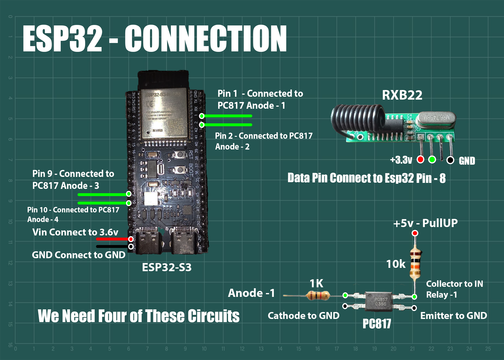

# Project Content
  

## Circuit Connections

 

## Web Page

<table align="center">
  <tr>
    <td style="padding-right: 40px;">
      
    </td>
    <td>
      
    </td>
  </tr>
</table>

 

## My Sample Circuit 

 

### For additional explanations and parts list, refer to this [Persian file](/Contents/Docs/Work-Report.pdf)

